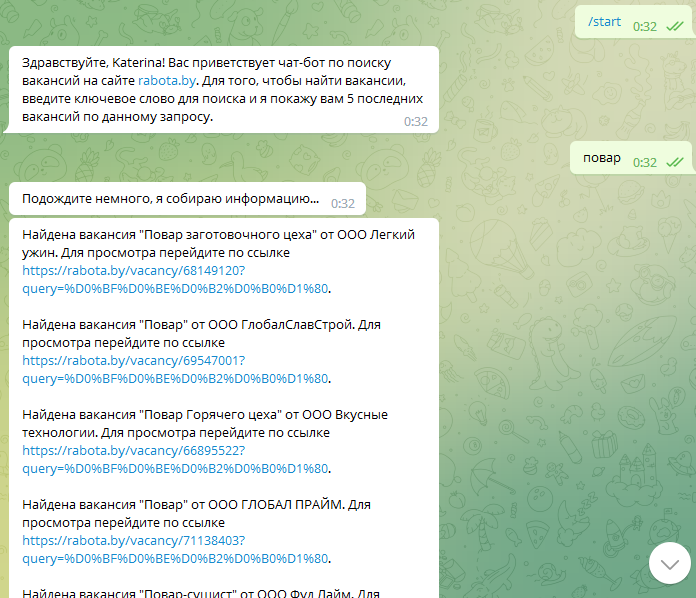

# bot-parser-selenium

Телебот выполнен при помощи:

- Python 3.10
- pyTelegramBotAPI 4.7
- selenium 4.5

Программа состоит из:

- Парсера (parser.by), работающего на selenium
- Чат-бота (bot.py), созданного на pyTelegramBotAPI

Принцип действия:

Чат-бот просит ввести ключевое слово для поиска вакансий. После введения начинает работать парсер, который находит последние 5 вакансий по данному запросу. Бот отображает название вакансии, организацию, объявившую вакансию, и ссылку на вакансию.
